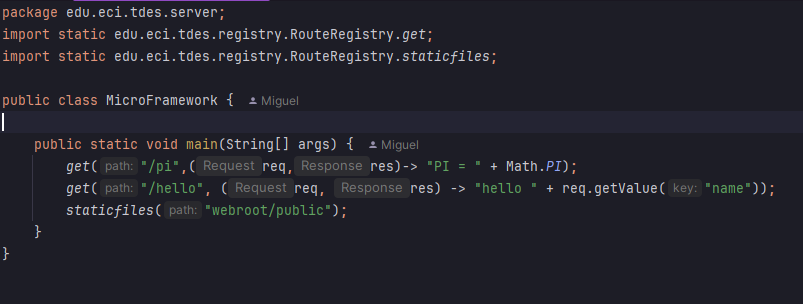
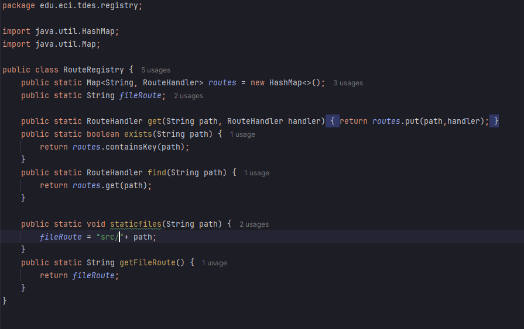
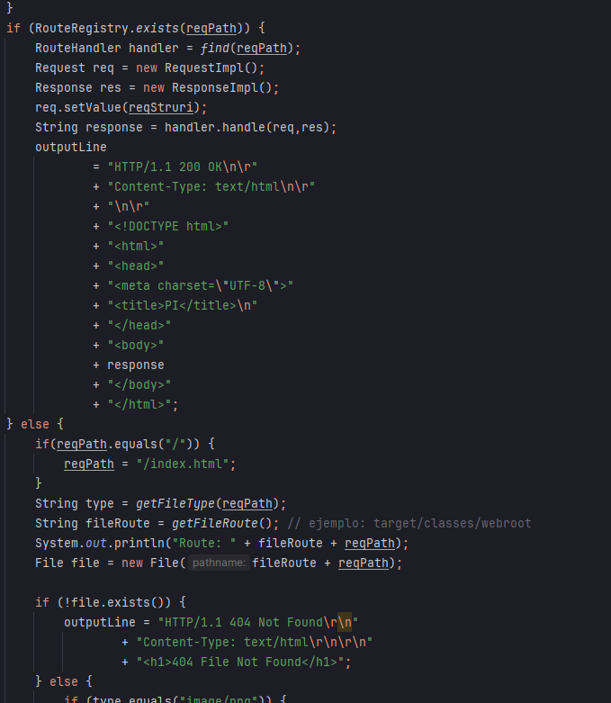
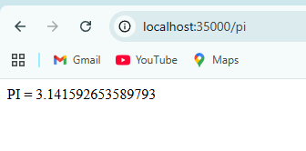

# 🚀 MICROFRAMEWORK


## 📖 Project Description

---
### Project Structure
```text
project-root
│
├── webroot/                # Static files (frontend)
│   ├── index.html
│   ├── css/
│   ├── js/
│   └── images/
│
└── src/main/java/
    ├── server/             # HTTP server initialization and socket handling
    ├── registry/           # Endpoint and route registration
    ├── request/            # HTTP request parsing and representation
    └── response/           # HTTP response construction

```

---
### 🏗️ Architecture

The project follows a modular monolithic architecture composed of four main layers, each with a well-defined responsibility:

> - **Server layer**  
   Responsible for establishing the connection between the browser and the application. It initializes the HTTP server, registers endpoints, and manages the routing of static file paths.
 
> - **Registry layer**  
   Handles the registration and organization of all available endpoints and their associated functionalities.

> - **Request layer**  
   Defines and processes the structure of incoming HTTP requests, including headers, parameters, and body data.
 
> - **Response layer**  
  Defines and constructs the structure of outgoing HTTP responses, including status codes, headers, and content.

This layered design promotes separation of concerns, improves maintainability, and simplifies the extension of new endpoints and features.

---
### 🔍 How does it work?
> - The microframework class defines the endpoints that the application will have.
> 

> - When endpoints are defined, they are registered in the **RouteRegistry** class. This class maintains a dictionary (HashMap) that maps each route path to a corresponding functionality. Additionally, it stores the paths of static resources to allow direct access to static files.> 
> - An important design detail is that each route is associated with a **RouteHandler**, which is defined as a functional interface. This approach enables endpoints to be declared in a clean and expressive way, following the same style used in the MicroFramework.
> 

> - The **HTTPServer** class is responsible for establishing the connection with the client through a socket and managing the request lifecycle. When a request arrives, the server extracts the requested path and checks whether a matching endpoint exists in the registry.
> - If an endpoint is found, the corresponding RouteHandler is executed to generate the response. Otherwise, the server attempts to locate the requested resource in the static files directory by determining its file type.
>

> - If neither a dynamic endpoint nor a static file is found, the system automatically returns a **404 Not Found** response.>
> - This process ensures a clear separation between dynamic request handling and static file serving, while providing a simple and extensible routing mechanism.
 
---

## ⚙️ Function Example

When the service starts, the example configuration is automatically loaded because the MicroFramework class already contains a predefined set of endpoints and a path for serving static files.
Based on this setup, the development flow can be described as follows:

1. Creation of endpoints and definition of their corresponding functions.
2. Definition of the static files path used to serve frontend resources.
3. Development of the website by creating static files such as , , , and  images.
4. Once the server is running, requests can be made through the URL provided by the server socket to access both dynamic endpoints and static resources, such as the following examples:
    - **Endpoints**
    > - http://localhost:35000/pi
    > 
    > 
    > - http://localhost:35000/hello?name=miguel
    > 
    > 
    - **StaticFiles**
    > - http://localhost:35000/index.html
    > 
    > 
    > - http://localhost:35000/inde.html
    > 
    > 
